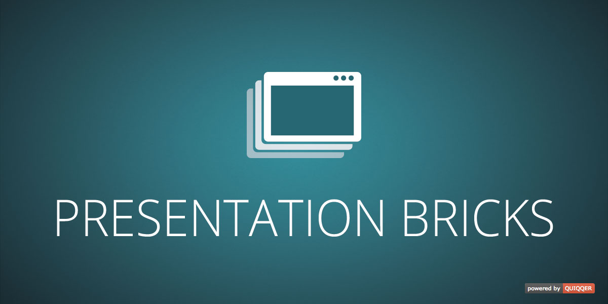

QUIQQER Presentation Bricks
===========================

This package contains bricks for the presentation of app or program on your website.
To get the best display result we recommend to use the package together with Presentation Template.

Packagename:

    quiqqer/presentation-bricks

Features
--------

- Sticky content: fixed mockup in the middle with scroll text on the right side.
- Wallpaper brick with content (text and image) and scroll arrow. Perfect for header.
- Simple brick with text and image background. Text position can be set in settings.

Installation
------------

The package name is: quiqqer/presentation-bricks

Contribute
----------

- Project: https://dev.quiqqer.com/quiqqer/presentation-bricks
- Issue Tracker: https://dev.quiqqer.com/quiqqer/presentation-bricks/issues
- Source Code: https://dev.quiqqer.com/quiqqer/presentation-bricks/tree/master

Support
-------

If you have found a bug or want to make improvements,
then you can write an e-mail to support@pcsg.de.

License
-------

GPL-3.0+